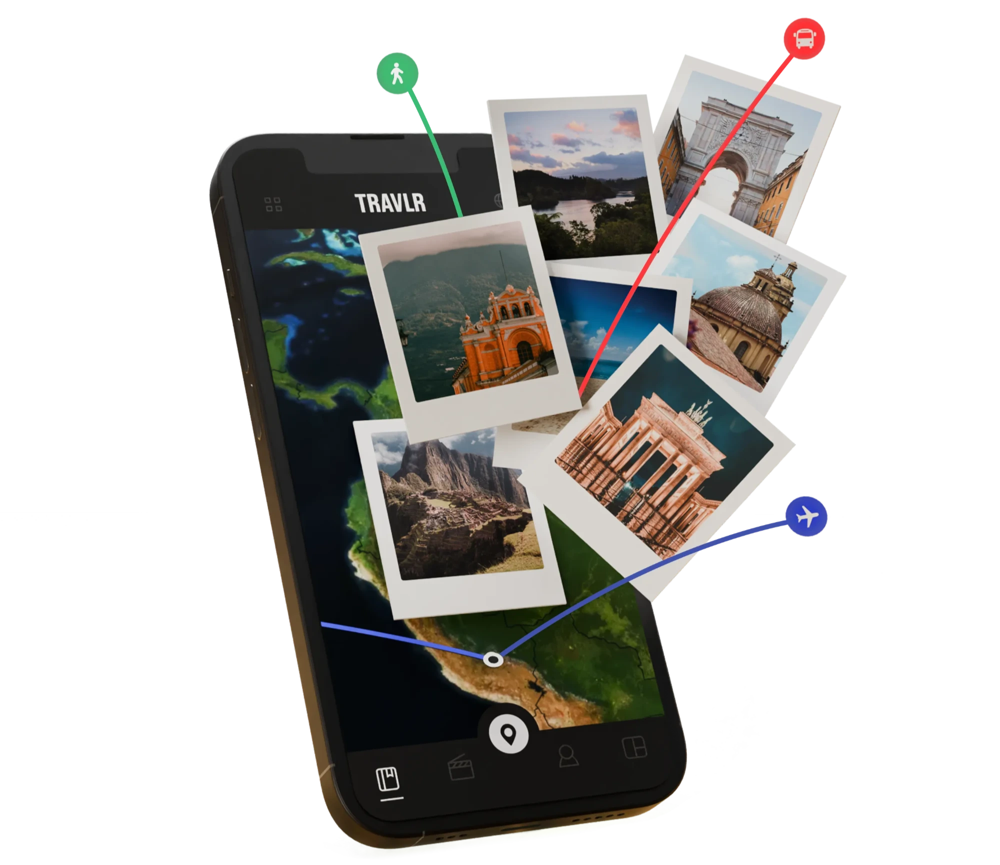
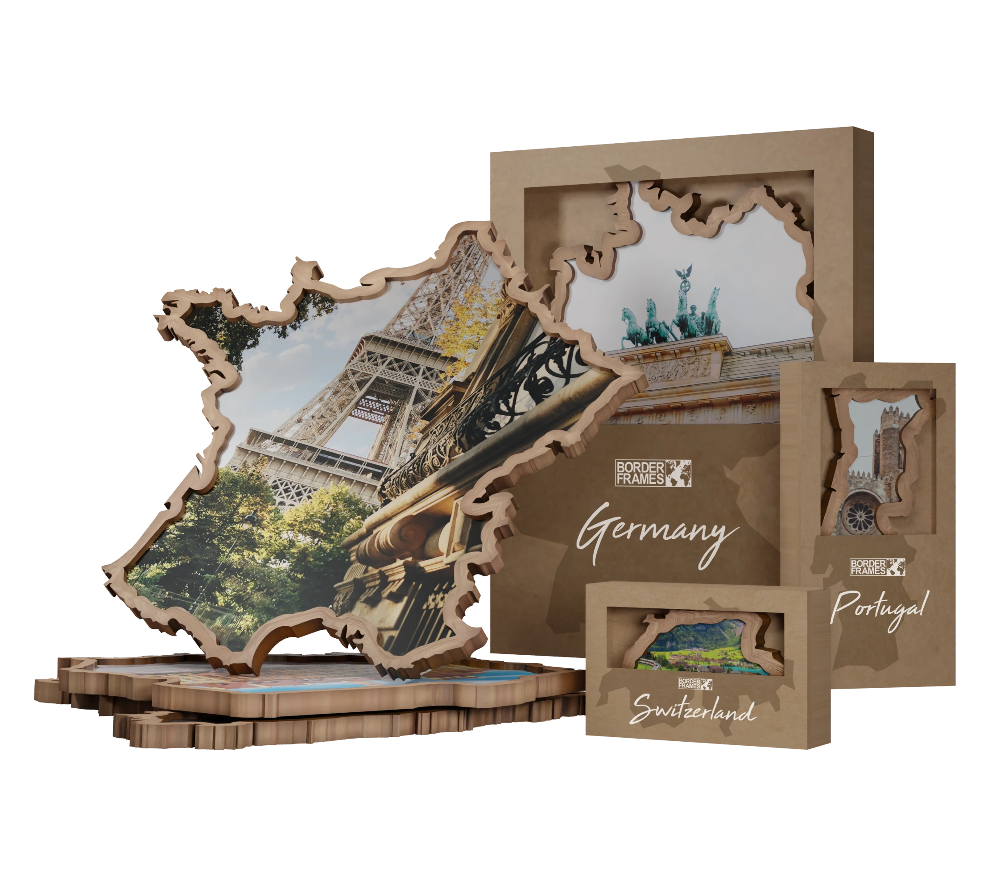

## Selected work

### TRAVLR

| | |
|---|---|
| A travel memory system built for continuity.  The globe as structure. Context over fragments. Designed for journeys measured in years.  → https://travlr.earth |  |

---

### Borderframes

| | |
|---|---|
|  | A modular physical–digital memory object.  Country by country. Frame by frame. Connecting physical space with digital history via NFC.  Built to grow slowly. Built to stay.  → https://borderframes.com |
